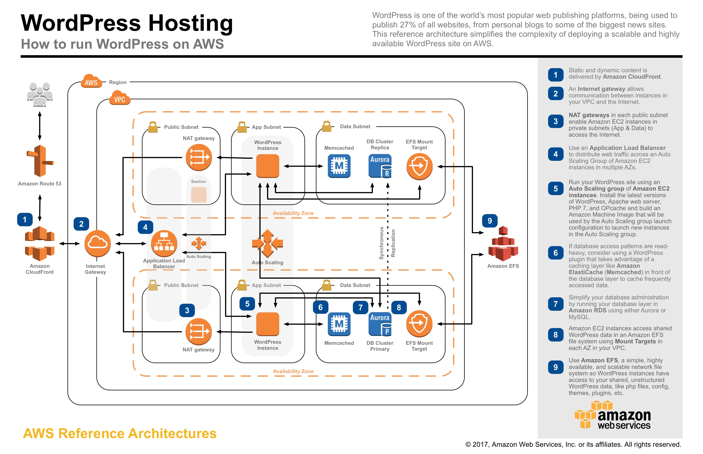

# Hosting WordPress on AWS

This reference architecture provides a set of YAML templates for deploying WordPress on AWS using [Amazon Virtual Private Cloud (Amazon VPC)](http://docs.aws.amazon.com/AmazonVPC/latest/UserGuide/VPC_Introduction.html), [Amazon Elastic Compute Cloud (Amazon EC2)](http://docs.aws.amazon.com/AWSEC2/latest/UserGuide/concepts.html), [Auto Scaling](http://docs.aws.amazon.com/autoscaling/latest/userguide/WhatIsAutoScaling.html), [Elastic Load Balancing (Application Load Balancer)](http://docs.aws.amazon.com/elasticbalancing/latest/application/introduction.html), [Amazon Relational Database Service (Amazon RDS)](http://docs.aws.amazon.com/AmazonRDS/latest/UserGuide/Welcome.html), [Amazon ElastiCache](http://docs.aws.amazon.com/AmazonElastiCache/latest/UserGuide/WhatIs.html), [Amazon Elastic File System (Amazon EFS)](http://docs.aws.amazon.com/efs/latest/ug/whatisefs.html), [Amazon CloudFront](http://docs.aws.amazon.com/AmazonCloudFront/latest/DeveloperGuide/Introduction.html), [Amazon Route 53](http://docs.aws.amazon.com/Route53/latest/DeveloperGuide/Welcome.html), [Amazon Certificate Manager (Amazon ACM)](http://docs.aws.amazon.com/acm/latest/userguide/acm-overview.html)  with [AWS CloudFormation](http://docs.aws.amazon.com/AWSCloudFormation/latest/UserGuide/Welcome.html).

You can launch this CloudFormation stack, using your account, in the following AWS Regions:

| AWS Region Code | Name | Launch |
| --- | --- | --- 
| us-east-1 |US East (N. Virginia)| [](https://console.aws.amazon.com/cloudformation/home?region=us-east-1#/stacks/new?stackName=WordPress&templateURL=https://s3.amazonaws.com/aws-refarch/wordpress/latest/templates/aws-refarch-wordpress-master.yaml) |
| us-east-2 |US East (Ohio)| [](https://console.aws.amazon.com/cloudformation/home?region=us-east-2#/stacks/new?stackName=WordPress&templateURL=https://s3.amazonaws.com/aws-refarch/wordpress/latest/templates/aws-refarch-wordpress-master.yaml) |
| us-west-2 |US West (Oregon)| [](https://console.aws.amazon.com/cloudformation/home?region=us-west-2#/stacks/new?stackName=WordPress&templateURL=https://s3.amazonaws.com/aws-refarch/wordpress/latest/templates/aws-refarch-wordpress-master.yaml) |
| eu-west-1 |EU (Ireland)| [](https://console.aws.amazon.com/cloudformation/home?region=eu-west-1#/stacks/new?stackName=WordPress&templateURL=https://s3.amazonaws.com/aws-refarch/wordpress/latest/templates/aws-refarch-wordpress-master.yaml) |
| ap-southeast-2 |AP (Sydney)| [](https://console.aws.amazon.com/cloudformation/home?region=ap-southeast-2#/stacks/new?stackName=WordPress&templateURL=https://s3.amazonaws.com/aws-refarch/wordpress/latest/templates/aws-refarch-wordpress-master.yaml) |

## Overview



The repository consists of a set of nested templates which are run in order from the master template. Run the master template to create the entire stack, entering the appropriate parameters. Nested templates can be run individually in order, entering the appropriate input parameters for each stack.


## Steps to Run
To launch the entire stack and deploy a WordPress site on AWS, click on one of the ***Launch Stack*** links above or download the Master template and launch it locally.

#### Optional: Amazon Certificate Manager SSL/TLS Certificates

AWS Certificate Manager (ACM) is a service that lets you easily provision, manage, and deploy Secure Sockets Layer/Transport Layer Security (SSL/TLS) certificates for use with AWS services. SSL/TLS certificates provisioned through AWS Certificate Manager are free.

If you don't already have an SSL/TLS certificate for your domain name, it is recommended that you request one using ACM. For more information about requesting an SSL/TLS certificate using ACM, please read the [AWS Certificate Manager User Guide](http://docs.aws.amazon.com/acm/latest/userguide/acm-overview.html).

Use ACM to request a certificate or import a certificate into ACM. To use an ACM certificate with CloudFront (optional input parameter), you must request or import the certificate in the US East (N. Virginia) region. To use an ACM certificate with Amazon ELB - Application Load Balancer (optional input parameter), you must request or import the certificate in the region you create the CloudFormation stack. After you validate ownership of the domain names in your certificate, ACM provisions the certificate. Use the ACM certificate Amazon Resource Name (ARN) as the optional Cloudfront and/or Public ALB ACM certificate input parameters of the master template.

#### Stack Creation

There are two output URLs for the master template. The WPSiteURL will take you to your new WordPress site. It will be the site domain name if you provided one, the CloudFront URL if you chose to create a CloudFront distribution, or the domain name of the public application load balancer.  The second output URL will take you to the OpCache Status page for each EC2 instance in the AutoScaling group. By refreshing the page you will be able to verify OpCache has been enabled on each instance.

#### OPcache

OPcache is a byte-code cache engine running on each EC2 instance that caches precompiled PHP scripts that boosts performance of PHP applications like WordPress. It is recommended to use a caching engine like OpCache when serving PHP pages for a website from Amazon EFS.  OPcache can be configured to store it's cache in memory or on EBS volumes.

##### Recommended OPcache Configuration Settings

- Mount the EFS file system using the default Linux mount options identified in the [Amazon EFS User Guide](http://docs.aws.amazon.com/efs/latest/ug/mounting-fs-mount-cmd-general.html).
Please confirm that the following options are not used when mounting the EFS file system: actimeo=3 or acregmax=3 or acdirmax=3. These options generate significantly higher metadata operations by timing out the attribute caches more frequently.
 
- Set the realpath_cache_size to atleast 512k. Also, please get the realpath_cache_size for your workload and make sure that it is less than 512k. You can do this by placing a php file (you can use any name – for example realpathcache.php) with the following contents in your WordPress directory and accessing. Please refresh the page multiple times before getting the final value:
```
<?php
 print_r(realpath_cache_size());
?>
```
 
- Please get the number of php files using “find . -type f -print | grep php | wc -l” in your WordPress directory. This number should be smaller than your opcache.max_accelerated_files settings. This setting controls how many PHP files, at most, can be held in memory at once. It's important that your project has LESS FILES than whatever you set this at.

- Please set the opcache.memory consumption to 512MB (opcache.memory_consumption=512). The default value for this 64 (MB). In case memory size turns out to be a limiting factor for your workload, we can even configure opcache.file_cache. Also, please disable the opcache.validate_timestamps. Though it is not recommended that validate_timestamps is disabled in production, this ensures that calls are not being made to the NFS server to ensure opcache’s coherency during your testing.

To learn more about OPcache, please read http://php.net/manual/en/book.opcache.php

#### Offloading Static Assets

WordPress has a large partner ecosystem to further enhance the usability, performance, and ease of maintenance of WordPress deployments. Plugins, like W3TotalCache, allow you to leverage other AWS services like Amazon S3 and Amazon CloudFront to offload and store static content. Others may like the simplicity of storing all content on Amazon EFS and avoid installing and managing 3rd party plugins. 

## Master Template
The master template receives all input parameters and passes them to the appropriate nested template which are executed in order based on conditions and dependencies.
Review the template here [aws-refarch-wordpress-master.yaml](templates/aws-refarch-wordpress-master.yaml)

### AWS Resources Created:

- Amazon Virtual Private Cloud (Amazon VPC)
- Internet Gateway (IGW)
- NAT Gateway (across all public subnets)
- Multiple Amazon VPC subnets (public & private) in 2 or 3 (if available) Availability Zones (AZs)
- Routing tables for public subnets - routing through IGW
- Routing tables for private subnets - routing through NAT Gateway
- Mulitple VPC Security Groups
- Bastion Auto Scaling Group (launching no instances) - in public subnets (public)
- Amazon Relational Database Service (Amazon RDS) Aurora cluster - in private subnets (data)
- Amazon Elastic File System (Amazon EFS) file system - with mount targets in private subnets (data)
- Amazon ElastiCache cache cluster (optional) - in private subnets (data)
- Amazon Elastic Load Balancing (Amazon ELB) Application Load Balancer (ALB) - in public subnets (public)
- Web Auto Scaling Group (launching 2 instances) - in private subnets (web)
- Amazon CloudFront distribution (optional)
- Amazon Route53 DNS record set (optional)

### Input Parameters

#### AWS Parameters
- EC2 Key Name Pair
- SSH Access CIDR block (to access bastion host)

#### Database Parameters
- Database Name
- Database Master Username
- Database Master Password
- Database Size
- Database Instance Class Type
- Create ElastiCache cluster (boolean)
- ElastiCache Node Type

#### Web Parameters
- Create CloudFront distribution (boolean)
- Create Route 53 record set (boolean)
- Web Instance Type

#### WordPress Parameters
- CloudFront ACM certificate ARN (must be requested from us-east-1)
- ALB ACM certificate ARN (must be requested from the stack region using the WordPress site domain name)
- WordPress Title
- WordPress Administrator Username
- WordPress Administrator Username Password
- WordPress Administrator Email Address
- WordPress Site Domain Name (e.g. 'example.com')
- WordPress Main Language of the site


## Master Template
The master template receives all input parameters and passes them to the appropriate nested template which are executed in order based on dependencies.
Review the template here [aws-refarch-wordpress-master.yaml](templates/aws-refarch-wordpress-master.yaml)

## New VPC Template
Review the template here [aws-refarch-wordpress-01-newvpc.yaml](templates/aws-refarch-wordpress-01-newvpc.yaml)

### VPC and subnet IP ranges

The 'newvpc' stack creates the following network design:

| Item | CIDR Range | Usable IPs | Description |
| --- | --- | --- | --- |
| VPC | 10.0.0.0/16 | 65,536 | The whole range used for the VPC and all subnets |
| Web Subnet | 10.0.0.0/22 | 1022 | Private subnet in first Availability Zone |
| Web Subnet | 10.0.4.0/22 | 1022 | Private subnet in second Availability Zone |
| Web Subnet | 10.0.8.0/22 | 1022 | Private subnet in third Availability Zone (if available) |
| Data Subnet | 10.0.12.0/22 | 1022 | Private subnet in first Availability Zone |
| Data Subnet | 10.0.16.0/22 | 1022 | Private subnet in second Availability Zone |
| Data Subnet | 10.0.20.0/22 | 1022 | Private subnet in third Availability Zone (if available) |
| Public Subnet | 10.0.250.0/23 | 510 | Public subnet in first Availability Zone |
| Public Subnet | 10.0.252.0/23 | 510 | Public subnet in second Availability Zone |
| Public Subnet | 10.0.254.0/23 | 510 | Public subnet in third Availability Zone (if available) |

You can adjust the CIDR ranges used in this section of the [aws-refarch-wordpress-01-newvpc.yaml](/templates/aws-refarch-wordpress-01-newvpc.yaml) template:

```
Mappings:
  SubnetConfig:
    Vpc:
      CIDR: 10.0.0.0/16
    WebSubnet0:
      CIDR: 10.0.0.0/22
    WebSubnet1:
      CIDR: 10.0.4.0/22
    WebSubnet2:
      CIDR: 10.0.8.0/22
    DataSubnet0:
      CIDR: 10.0.12.0/22
    DataSubnet1:
      CIDR: 10.0.16.0/22
    DataSubnet2:
      CIDR: 10.0.20.0/22
    PublicSubnet0:
      CIDR: 10.0.250.0/23
    PublicSubnet1:
      CIDR: 10.0.252.0/23
    PublicSubnet2:
      CIDR: 10.0.254.0/23
```

## Security Groups Template
Review the template here [aws-refarch-wordpress-02-securitygroups.yaml](templates/aws-refarch-wordpress-02-securitygroups.yaml)

## Bastion Template
Review the template here [aws-refarch-wordpress-03-bastion.yaml](templates/aws-refarch-wordpress-03-bastion.yaml)

## Amazon EFS Template
Review the template here [aws-refarch-wordpress-03-efs.yaml](templates/aws-refarch-wordpress-03-efs.yaml)

## Amazon ElastiCache Template
Review the template here [aws-refarch-wordpress-03-elasticache.yaml](templates/aws-refarch-wordpress-03-elasticache.yaml)

## Amaazon Elastic Load Balancing - Application Load Balancer Template
Review the template here [aws-refarch-wordpress-03-publicelb.yaml](templates/aws-refarch-wordpress-03-publicalb.yaml)

## Amazon RDS Template
Review the template here [aws-refarch-wordpress-03-rds.yaml](templates/aws-refarch-wordpress-03-rds.yaml)

## Amazon CloudFront Template
Review the template here [aws-refarch-wordpress-04-cloudfront.yaml](templates/aws-refarch-wordpress-04-cloudfront.yaml)

## WordPress Web Template
Review the template here [aws-refarch-wordpress-04-web.yaml](templates/aws-refarch-wordpress-04-web.yaml)

## Amazon Route 53 Template
Review the template here [aws-refarch-wordpress-05-route53.yaml](templates/aws-refarch-wordpress-05-route53.yaml)


## Add a new item to this list

If you found yourself wishing this set of frequently asked questions had an answer for a particular problem, please [submit a pull request](https://help.github.com/articles/creating-a-pull-request-from-a-fork/). The chances are that others will also benefit from having the answer listed here.


## License

Portions copyright.

- WordPress is licensed under the General Public License (GPLv2 or later) from the Free Software Foundation.

- OPcache is licensed under PHP License, version 3.01.

Please see LICENSE.txt for applicable license terms and NOTICE.txt for applicable notices.


