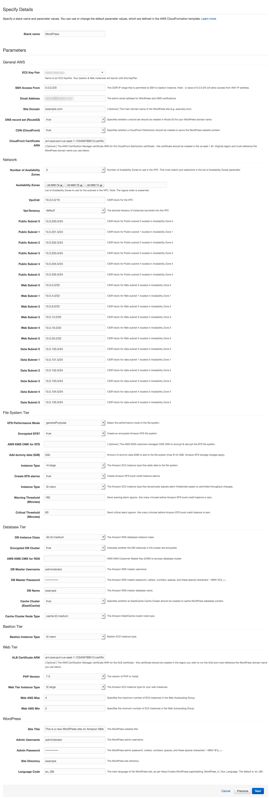
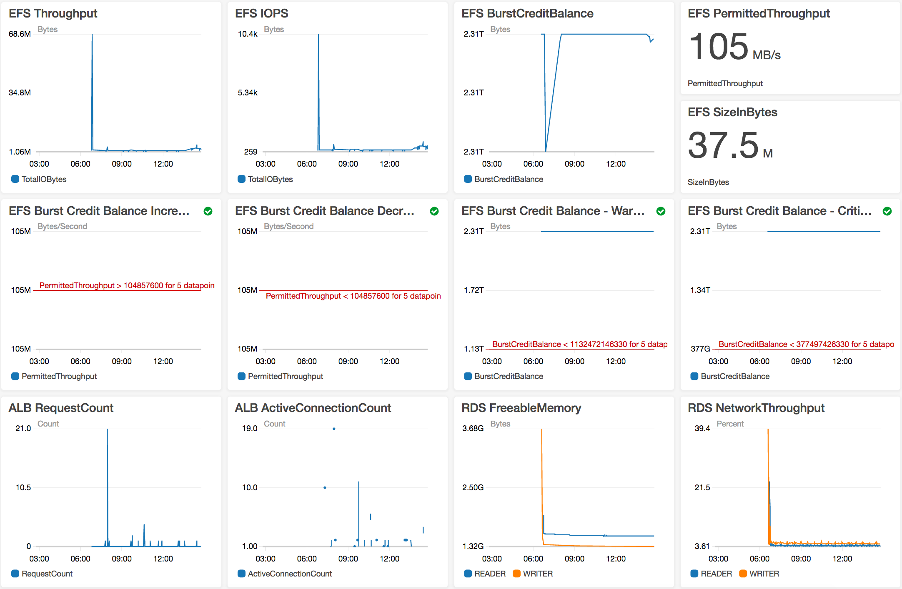

# **Hosting WordPress on AWS**

### Version 2.0.2

ara-wp-2.0.2

---

This reference architecture provides a set of YAML templates for deploying WordPress on AWS using [Amazon Virtual Private Cloud (Amazon VPC)](http://docs.aws.amazon.com/AmazonVPC/latest/UserGuide/VPC_Introduction.html), [Amazon Elastic Compute Cloud (Amazon EC2)](http://docs.aws.amazon.com/AWSEC2/latest/UserGuide/concepts.html), [Auto Scaling](http://docs.aws.amazon.com/autoscaling/latest/userguide/WhatIsAutoScaling.html), [Elastic Load Balancing (Application Load Balancer)](https://docs.aws.amazon.com/elasticloadbalancing/latest/application/introduction.html), [Amazon Relational Database Service (Amazon RDS)](http://docs.aws.amazon.com/AmazonRDS/latest/UserGuide/Welcome.html), [Amazon ElastiCache](http://docs.aws.amazon.com/AmazonElastiCache/latest/UserGuide/WhatIs.html), [Amazon Elastic File System (Amazon EFS)](http://docs.aws.amazon.com/efs/latest/ug/whatisefs.html), [Amazon CloudFront](http://docs.aws.amazon.com/AmazonCloudFront/latest/DeveloperGuide/Introduction.html), [Amazon Route 53](http://docs.aws.amazon.com/Route53/latest/DeveloperGuide/Welcome.html), [Amazon Certificate Manager (Amazon ACM)](http://docs.aws.amazon.com/acm/latest/userguide/acm-overview.html)  with [AWS CloudFormation](http://docs.aws.amazon.com/AWSCloudFormation/latest/UserGuide/Welcome.html).


## Overview


The repository consists of a set of nested templates which are run in order from the master template. Run the master template to create the entire stack, entering the appropriate parameters. Nested templates can be run individually in order, entering the appropriate input parameters for each stack.

## Update

Please refer to [history.md](/HISTORY.md) for a detailed list of changes in 2.0.2.

## Parameters



## Steps to Run
To launch the entire stack and deploy a WordPress site on AWS, click on one of the ***Launch Stack*** links below or download the Master template and launch it locally.

You can launch this CloudFormation stack, using your account, in the following AWS Regions:

| AWS Region Code | Name | Launch |
| --- | --- | --- 
| us-east-1 |US East (N. Virginia)| [](https://console.aws.amazon.com/cloudformation/home?region=us-east-1#/stacks/new?stackName=WordPress&templateURL=https://s3.amazonaws.com/aws-refarch/wordpress/latest/templates/aws-refarch-wordpress-master-newvpc.yaml) |
| us-east-2 |US East (Ohio)| [](https://console.aws.amazon.com/cloudformation/home?region=us-east-2#/stacks/new?stackName=WordPress&templateURL=https://s3.amazonaws.com/aws-refarch/wordpress/latest/templates/aws-refarch-wordpress-master-newvpc.yaml) |
| us-west-2 |US West (Oregon)| [](https://console.aws.amazon.com/cloudformation/home?region=us-west-2#/stacks/new?stackName=WordPress&templateURL=https://s3.amazonaws.com/aws-refarch/wordpress/latest/templates/aws-refarch-wordpress-master-newvpc.yaml) |
| eu-west-1 |EU (Ireland)| [](https://console.aws.amazon.com/cloudformation/home?region=eu-west-1#/stacks/new?stackName=WordPress&templateURL=https://s3.amazonaws.com/aws-refarch/wordpress/latest/templates/aws-refarch-wordpress-master-newvpc.yaml) |
| eu-central-1 |EU (Frankfurt)| [](https://console.aws.amazon.com/cloudformation/home?region=eu-central-1#/stacks/new?stackName=WordPress&templateURL=https://s3.amazonaws.com/aws-refarch/wordpress/latest/templates/aws-refarch-wordpress-master-newvpc.yaml) |
| ap-southeast-2 |AP (Sydney)| [](https://console.aws.amazon.com/cloudformation/home?region=ap-southeast-2#/stacks/new?stackName=WordPress&templateURL=https://s3.amazonaws.com/aws-refarch/wordpress/latest/templates/aws-refarch-wordpress-master-newvpc.yaml) |

#### Select WordPress version

The version of WordPress can be selected. Possible values are latest, nightly, 4.5, 4.6, 4.7, 4.8, 4.9.

#### Override PHP.ini defaults by downloading an overrides ini file from Amazon S3

Create a custom .ini file that includes PHP overrides and make it publically available in an S3 bucket. These could be common overrides like **memory_limit**, **post_max_size**, **upload_max_filesize**, **max_input_time**, **max_execution_time**, etc. Amazon S3 object path should use https format (e.g.https://s3.amazonaws.com/aws-refarch/wordpress/latest/bits/20-aws.ini). Sample PHP overrides are below and in the [samples/20-aws.ini](samples/20-aws.ini) directory.

; Enable php.ini overrides for hosting WordPress on AWS - https://github.com/awslabs/aws-refarch-wordpress

memory_limit = 128M

post_max_size = 0

upload_max_filesize = 64M

max_input_time = 60

max_execution_time = 30

#### Using Bastion to access Wordpress instances

From the EC2 console, navigate to Auto Scaling groups and find the Bastion launch configuration for your stack. Edit the launch configuration and set the desired instances to 1. Press Save and the Bastion instance will be created. Bastion is a gateway to your instances for enhanced security. 

The Wordpress CLI is enabled on each instance, SSH into Bastion, then SSH into an instance. From the wordpress install directory `/var/www/wordpress/<site directory>` use the `wp` command to interact with your wordpress install.

#### Amazon EFS resources & dashboard

This AWS Cloudformation template, and nested templates, will create an Amazon EFS file system and other AWS resources to monitor and send notifications if the burst credit balance of the file system drops below predefined thresholds. These alarms and other AWS CloudWatch metrics, including a file system size custom metric are added as widgets to a CloudWatch dashboard.

Throughput on Amazon EFS scales as a file system grows. Because file-based workloads are typically spiky—driving high levels of throughput for short periods of time, and low levels of throughput the rest of the time—Amazon EFS is designed to burst to high throughput levels for periods of time. Amazon EFS uses a credit system to determine when file systems can burst. Each file system earns credits over time at a baseline rate that is determined by the size of the file system, and uses credits whenever it reads or writes data. The baseline rate is 50 MiB/s per TiB of storage (equivalently, 50 KiB/s per GiB of storage). Accumulated burst credits give the file system permission to drive throughput above its baseline rate. When a file system has a positive burst credit balance, it can burst. The burst rate is 100 MiB/s per TiB of storage (equivalently, 100 KiB/s per GiB of storage).

If your WordPress deployment accessing the file system relies on the burst throughput for normal operations, running out of burst credits could negatively impact the workload, so monitoring the file system's burst credit balance is essential. The efsalarms template will create two Amazon CloudWatch alarms that will send email notifications if the burst credit balance drops below two predefined thresholds, a 'Warning' threshold and a 'Critical' threshold.  These thresholds are based on the number of minutes it would take to completely use all burst credits if the file system was being driven at the highest throughput rate possible, the permitted throughput rate. You enter these minute variables as input parameters in the Cloudformation template. The 'Warning' threshold and has a default value of 180 minutes. This means that a CloudWatch alarm will send an email notification 180 minutes before the credit balance drops to zero, based on the latest permitted throughput rate. The second alarm and notification is a 'Critical' notification and has a default value of 60 minutes. This alarm will send an email notification 60 minutes before the credit balance drops to zero, based on the latest permitted throughput rate. Permitted throughput is dynamic, scaling up as the file systems grows and scaling down as the file system shrinks. Therefore a third and fourth alarm is create that monitors permitted throughput. If the permitted throughput increases or decreases, an email notification is sent and an Auto Scaling Group will launch an EC2 instance that dynamically resets the 'Warning' and 'Critical' thresholds based on the latest permitted throughput rate. This EC2 instance will auto terminate and a new instance will launch to reset the thresholds only when the permitted throughput rate increases or decreases.

A new AWS CloudWatch dashboard is also created with some Amazon EFS, Amazon RDS, Amazon ELB, and custom metrics. Amazon EFS burst credit balance threshold alarms are also displayed if they were selected to be created.

#### Sample dashboard



#### Optional: Encrypting Amazon Aurora DB data at Rest

This reference architecture now allows you to encrypt your databases using keys you manage through AWS Key Management Service (KMS). On a database instance running with Amazon Aurora encryption, data stored at rest in the underlying storage is encrypted, as are the automated backups, snapshots, and replicas in the same cluster. Encryption and decryption are handled seamlessly so you don’t have to modify your application to access your data. When you launch this AWS Cloudformation stack, you can choose to enable database encryption via a parameter in the master template. You may use the default RDS key automatically created in your account by leaving the *"Existing AWS KMS CMK for RDS"* parameter empty or use a key you created using KMS to encrypt your data.

#### Optional: Encrypting Amazon EFS Data & Metadata at Rest

Amazon EFS integrates with AWS Key Management Service (KMS) to support encryting file system contents using AWS KMS Customer Master Keys (CMKs). In an encrypted file system, data and metadata are automatically encrypted before being written to the file system. Similarly, as data and metadata are read, they are automatically decrypted before being presented to the application. These processes are handled transparently by Amazon EFS, so you don’t have to modify WordPress to take advantage of encrypted file systems. Encryption at rest is enabled by default for file systems you create using this cloudformation template. This option is exposed as a configurable Cloudformation template parameter. 'true' creates an encrypted file system. 'false' creates an unencrypted file system. To use the AWS-managed CMK for Amazon EFS (key alias: aws/elasticfilesystem) leave the *"Existing AWS KMS CMK for EFS"* parameter empty. To use a specific customer-managed CMK (within this AWS account or another AWS account) enter the CMKs ARN in the "Existing AWS KMS CMK for EFS" parameter field.

#### Optional: Amazon Certificate Manager SSL/TLS Certificates

AWS Certificate Manager (ACM) is a service that lets you easily provision, manage, and deploy Secure Sockets Layer/Transport Layer Security (SSL/TLS) certificates for use with AWS services. SSL/TLS certificates provisioned through AWS Certificate Manager are free.

If you don't already have an SSL/TLS certificate for your domain name, it is recommended that you request one using ACM. For more information about requesting an SSL/TLS certificate using ACM, please read the [AWS Certificate Manager User Guide](http://docs.aws.amazon.com/acm/latest/userguide/acm-overview.html).

Use ACM to request a certificate or import a certificate into ACM. To use an ACM certificate with CloudFront (optional input parameter), you must request or import the certificate in the US East (N. Virginia) region. To use an ACM certificate with Amazon ELB - Application Load Balancer (optional input parameter), you must request or import the certificate in the region you create the CloudFormation stack. After you validate ownership of the domain names in your certificate, ACM provisions the certificate. Use the ACM certificate Amazon Resource Name (ARN) as the optional Cloudfront and/or Public ALB ACM certificate input parameters of the master template.

#### Stack Creation

There are two output URLs for the master template. The WPSiteURL will take you to your new WordPress site. It will be the site domain name if you provided one, the CloudFront URL if you chose to create a CloudFront distribution, or the domain name of the public application load balancer.  The second output URL will take you to the OpCache Status page for each EC2 instance in the AutoScaling group. By refreshing the page you will be able to verify OpCache has been enabled on each instance.

#### OPcache

OPcache is a byte-code cache engine running on each EC2 instance that caches precompiled PHP scripts that boosts performance of PHP applications like WordPress. It is recommended to use a caching engine like OpCache when serving PHP pages for a website from Amazon EFS.  OPcache can be configured to store it's cache in memory or on EBS volumes.

##### Recommended OPcache Configuration Settings

- Mount the EFS file system using the default Linux mount options identified in the [Amazon EFS User Guide](http://docs.aws.amazon.com/efs/latest/ug/mounting-fs-mount-cmd-general.html).
Changing some of the activating caching options from their defaults, like actimeo, acregmax, or acdirmax may generate significantly higher metadata operations by timing out the attribute caches more frequently. Careful testing is recommended if the defaults are not used.
 
- Increase the size of realpath_cache_size. Setting it to 512k is a good start but finding out how much realpath cache you’re actually using will help you fine tune this setting and be more precise. To find out how much real path cache you’re actually using, place the following php code snippet in a php file (you can use any name – for example realpathcache.php) and place it in your WordPress directory. Open a browser and point to this php file.  Refresh your page multiple times. The value being returned is the amount of memory in bytes realpath cache is using. Take note of the maximum value being returned after refreshing this page multiple times.  This, plus a little headroom, should be the value of the realpath_cache_size setting.
```
<?php
 print_r(realpath_cache_size());
?>
```
 
- Please get the number of php files using “find . -type f -print | grep php | wc -l” in your WordPress directory. This number should be smaller than your opcache.max_accelerated_files settings. This setting controls how many PHP files, at most, can be held in memory at once. It's important that your project has LESS FILES than whatever you set this at.

- The default value for opcache.memory consumption is 64 MB. Increasing this setting could improve performance by caching more files in memory. Consider setting this to a value of 512MB (opcache.memory_consumption=512) or more to improve performance. Testing different opcache.memory consumption values is recommended to optimize the performance for your particular workload. In case memory size turns out to be a limiting factor, the cloudformation template also configures opcache.file_cache to use local storage (an EBS or instance store volume). During testing we recommend disabling opcache.validate_timestamps so calls are not being made to the NFS server to ensure opcache’s coherency. It is not recommended that opcache.validate_timestamps be disabled in production.

To learn more about OPcache, please read http://php.net/manual/en/book.opcache.php

#### Offloading Static Assets

WordPress has a large partner ecosystem to further enhance the usability, performance, and ease of maintenance of WordPress deployments. Plugins, like W3-Total-Cache, allow you to leverage other AWS services like Amazon S3 and Amazon CloudFront to offload and store static content. Others may like the simplicity of storing all content on Amazon EFS and avoid installing and managing 3rd party plugins. 

#### Setup W3-Total-Cache
The W3-Total-Cache plugin is required for the reference architecutre to have the best performance. W3 allows Offloading of static assets, and impliments memcached to cache Objects, Database Queries, ect.

To setup W3-Total-Cache, activate it in plugins (Will be installed automatically on fresh CloudFormation launch). Navigate to ElasticCache -> Memcached in AWS, find the cluster created for the stack. Copy the **Configuration Endpoint** (formated: wor-el-1d6494yen6xl1.xxxxxx.cfg.usw2.cache.amazonaws.com:11211). Now under performance -> General, find the following options:

- Page Cache - enable, select Memcached
- Minify - enable, select Disk (Minified files will be offloaded)
- Database Cache - enable, select Memcached
- Object Cache - enable, select Memcached
- CDN - enable, select Amazon Cloudfront - Or Amazon Simple Storage Service
- Fragment Cache - enable, select Memcached

Press Save All & Purge Cache

You will see errors saying 127.0.0.1:11211 not accessible. 
Now Inside each menu in the sidebar navigation, scroll to Memcached server option (Advanced), and paste the ElasticCache Configuration Endpoint. Press test and ensure it passes.

Under Browser Cache, enable both **Set expires header** and **Set cache control header** (When testing this may be combersome)

Under CDN, paste in a valid and uniquely created IAM Key and Secret that has access to S3 or an S3 bucket. Paste in the Cloudfront prefix that was created with the stack. Also scroll to Advanced and select **Export changed files automatically**

Since files will be offloaded to S3, ensure to add the S3 bucket as an origin on your CloudFront Distribution. Simply navigate to the distribution, select the Origin tab, Create Origin, Click on the Origin Domain Name text field and find the S3 bucket used for CDN. **Note:** This will take some time, the Distribution will be In Progress until CDN replication is complete. 

## Master Template
The master template receives all input parameters and passes them to the appropriate nested template which are executed in order based on conditions and dependencies.
Review the template here [aws-refarch-wordpress-master.yaml](templates/aws-refarch-wordpress-master.yaml)

### AWS Resources Created:

- Amazon Virtual Private Cloud (Amazon VPC)
- Internet Gateway (IGW)
- NAT Gateway (across all public subnets)
- Amazon VPC subnets (public, private (data, web)) in all the Availability Zones (AZs) selected
- Routing tables for public subnets - routing through IGW
- Routing tables for private subnets - routing through NAT Gateway
- Mulitple VPC Security Groups
- Bastion Auto Scaling Group (launching no instances) - in public subnets (public)
- Amazon Relational Database Service (Amazon RDS) Aurora cluster - in private subnets (data)
- Amazon Elastic File System (Amazon EFS) file system - with mount targets in private subnets (data) w/ optional dummy data to grow the file system to achieve higher levels of throughput and IOPS
- File System Auto Scaling Group (launching 1 instance) - to add dummy data (it auto terminates by setting ASG desired count to 0)
- File System Auto Scaling Group (launching 1 instance) - to dynamically adjust warning and critical threshold values when the permitted throughput value changes (it auto terminates by setting ASG desired count to 0)
- Amazon CloudWatch alarms to monitor Amazon EFS burst credit balance
- Amazon ElastiCache cache cluster (optional) - in private subnets (data)
- Amazon Elastic Load Balancing (Amazon ELB) Application Load Balancer (ALB) - in public subnets (public)
- Web Auto Scaling Group (launching 2 instances) - in private subnets (web)
- Amazon CloudFront distribution (optional)
- Amazon Route53 DNS record set (optional)
- Amazon CloudWatch dashboard

### Input Parameters

#### General AWS
- EC2 Key Name Pair
- SSH Access CIDR block (to access bastion host)
- Email address for WordPress administration and SNS notifications
- Site Domain Name (e.g. 'example.com') - use this only if you will use your own custom domain name
- Select if you want to create a DNS record set for your custom dist domain name
- Select if you want to use a AWS CloudFront to cache images at AWS edge locations (3rd party plugins are required to leverage a CDN)
- Enter the ARN of the AWS Certificate Manager certificate you created in us-east-1 for your custom site domain name

#### Network
- Number of Avilability Zones (AZs) - from 2 to 6
- Select the individual Availability Zones where resources will be launched (the number of selected AZs must match the number of AZs selected above)
- VPC CIDR block
- VPC tenancy
- CIDR block for public subnets 1 to 6
- CIDR block for web subnets 1 to 6
- CIDR block for data subnets 1 to 6

#### File System
- Amazon EFS performance mode
- Encrypted file system (boolean)
- AWS KMS Customer Master Key ARN (if enabling encryption and using customer-managed CMK)
- Clone EFS, use the System ID of an existing EFS Filesystem. The data is copied to the Site Directory. If the Site Directory exists on the source filesystem, only the contents of the site directory are copied. So make sure if you are copying from an existing Wordpress Cloudformation template, that the site directory is the same.
- Add dummy data to the file system to achieve higher throughput & IOPS beyond the amount of data your WordPress environment will use. This value is in GiB.
- The instance type that will be used to dd dummy data into the file system
- Select if you want to create alarms that send SNS notifications when the file system's burst credit balance drops below certain thresholds.
- The instance type that will be used to dynamically adjust alarm thresholds as permitted throughput changes.
- The 'Warning' threshold has a default value of 180 minutes. This means that a CloudWatch alarm will send an email notification 180 minutes before the credit balance drops to zero, based on the latest permitted throughput rate.
- The 'Critical' threshold has a default value of 60 minutes. This means that a CloudWatch alarm will send an email notification 60 minutes before the credit balance drops to zero, based on the latest permitted throughput rate.

#### Database
- Database Name
- Database Master Username
- Database Master Password
- DB Restore from Snapshot, enter the cluster Snapshot name from the RDS console. (formatted rds:wordpress-stack-name-rds-xxxxxxxx-databasecluster-apzdbrozmzcn-snapshot-date)
- Database Size
- Database Instance Class Type
- Encrypted database storage (boolean)
- AWS KMS Customer Master Key ARN (if enabling encryption and using customer-managed CMK)
- Create ElastiCache cluster (boolean)
- ElastiCache Node Type

#### Bastion Parameters
- Bastion Instance Type

#### Web Parameters
- Create CloudFront distribution (boolean)
- Create Route 53 record set (boolean)
- PHP Version (5.5, 5.6, or 7.0 - recomended)
- Web Instance Type
- The maximum number of instances in the web tier auto scaling group
- The minimum (and desired) number of instances in the web tier auto scaling group

#### WordPress Parameters
- WordPress Title
- WordPress Administrator Username
- WordPress Administrator Username Password
- WordPress Main Language of the site
- Wordpress Site Directory

## Master Template
The master template receives all input parameters and passes them to the appropriate nested template which are executed in order based on dependencies.
Review the template here [aws-refarch-wordpress-master.yaml](templates/aws-refarch-wordpress-master.yaml)

## New VPC Template
Review the template here [aws-refarch-wordpress-01-newvpc.yaml](templates/aws-refarch-wordpress-01-newvpc.yaml)

### Default VPC and subnet IP ranges

The 'newvpc' stack defaults to the following network design (but these can be changed via master parameters):

| Item | CIDR Range | Usable IPs | Description |
| --- | --- | --- | --- |
| VPC | 10.0.0.0/16 | 65,536 | The whole range used for the VPC and all subnets |
| Web Subnet | 10.0.0.0/22 | 1022 | Private subnet in first Availability Zone |
| Web Subnet | 10.0.4.0/22 | 1022 | Private subnet in second Availability Zone |
| Web Subnet | 10.0.8.0/22 | 1022 | Private subnet in third Availability Zone |
| Web Subnet | 10.0.12.0/22 | 1022 | Private subnet in fourth Availability Zone |
| Web Subnet | 10.0.16.0/22 | 1022 | Private subnet in fifth Availability Zone |
| Web Subnet | 10.0.20.0/22 | 1022 | Private subnet in sixth Availability Zone |
| Data Subnet | 10.0.100.0/24 | 254 | Private subnet in first Availability Zone |
| Data Subnet | 10.0.101.0/24 | 254 | Private subnet in second Availability Zone |
| Data Subnet | 10.0.102.0/24 | 254 | Private subnet in third Availability Zone |
| Data Subnet | 10.0.103.0/24 | 254 | Private subnet in fourth Availability Zone |
| Data Subnet | 10.0.104.0/24 | 254 | Private subnet in fifth Availability Zone |
| Data Subnet | 10.0.105.0/24 | 254 | Private subnet in sixth Availability Zone |
| Public Subnet | 10.0.200.0/24 | 254 | Public subnet in first Availability Zone |
| Public Subnet | 10.0.201.0/24 | 254 | Public subnet in second Availability Zone |
| Public Subnet | 10.0.202.0/24 | 254 | Public subnet in third Availability Zone |
| Public Subnet | 10.0.203.0/24 | 254 | Public subnet in fourth Availability Zone |
| Public Subnet | 10.0.204.0/24 | 254 | Public subnet in fifth Availability Zone |
| Public Subnet | 10.0.205.0/24 | 254 | Public subnet in sixth Availability Zone |

## Security Groups Template
Review the template here [aws-refarch-wordpress-02-securitygroups.yaml](templates/aws-refarch-wordpress-02-securitygroups.yaml)

## Bastion Template
Review the template here [aws-refarch-wordpress-03-bastion.yaml](templates/aws-refarch-wordpress-03-bastion.yaml)

## Amazon EFS File System Template
Review the template here [aws-refarch-wordpress-03-efsfilesystem.yaml](templates/aws-refarch-wordpress-03-efsfilesystem.yaml)

## Amazon EFS Alarms Template
Review the template here [aws-refarch-wordpress-03-efsalarms.yaml](templates/aws-refarch-wordpress-03-efsalarms.yaml)

## Amazon ElastiCache Template
Review the template here [aws-refarch-wordpress-03-elasticache.yaml](templates/aws-refarch-wordpress-03-elasticache.yaml)

## Amazon Elastic Load Balancing - Application Load Balancer Template
Review the template here [aws-refarch-wordpress-03-publicelb.yaml](templates/aws-refarch-wordpress-03-publicalb.yaml)

## Amazon RDS Template
Review the template here [aws-refarch-wordpress-03-rds.yaml](templates/aws-refarch-wordpress-03-rds.yaml)

## Amazon CloudFront Template
Review the template here [aws-refarch-wordpress-04-cloudfront.yaml](templates/aws-refarch-wordpress-04-cloudfront.yaml)

## WordPress Web Template
Review the template here [aws-refarch-wordpress-04-web.yaml](templates/aws-refarch-wordpress-04-web.yaml)

## Amazon Route 53 Template
Review the template here [aws-refarch-wordpress-05-route53.yaml](templates/aws-refarch-wordpress-05-route53.yaml)

## Amazon CloudWatch Dashboard Template
Review the template here [aws-refarch-wordpress-06-dashboard.yaml](templates/aws-refarch-wordpress-06-dashboard.yaml)


## Add a new item to this list

If you found yourself wishing this set of frequently asked questions had an answer for a particular problem, please [submit a pull request](https://help.github.com/articles/creating-a-pull-request-from-a-fork/). The chances are that others will also benefit from having the answer listed here.


## License Summary

This sample code is made available under the MIT-0 license. See the LICENSE file.

It relies on WordPress and OPcache:

- WordPress is licensed under the General Public License (GPLv2 or later) from the Free Software Foundation.

- OPcache is licensed under PHP License, version 3.01.
